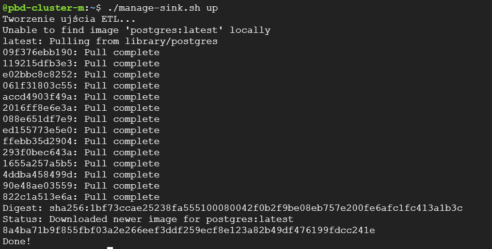

# NYC-Yellow-Taxi + Spark

# Zadania:

### ETL – obraz czasu rzeczywistego

Utrzymywanie agregacji na poziomie dnia i dzielnicy.
Wartości agregatów to:

- liczba wyjazdów
- liczba przyjazdów
- sumaryczna osób wyjeżdżających
- sumaryczna osób przyjeżdżających

### Wykrywanie "anomalii"

Wykrywanie "anomalii" ma polegać na wykrywaniu dużej różnicy w liczbie osób wyjeżdżających z danej dzielnicy w
stosunku do liczby przyjeżdżających do danej dzielnicy w określonym czasie.
Program ma być parametryzowany przez:

- D - długość okresu czasu wyrażoną w godzinach
- L - liczbę osób (minimalna)

Wykrywanie anomalii ma być dokonywane co godzinę. \
Przykładowo, dla parametrów D=4, L=10000 program co godzinę będzie raportował te dzielnice, w których w ciągu
ostatnich 4 godzin liczba osób "zmniejszyła się" o co najmniej 10 tysięcy osób.
Raportowane dane mają zawierać:

- analizowany okres - okno (start i stop)
- nazwę dzielnicy
- liczbę osób wyjeżdżających
- liczbę osób przyjeżdżających
- różnicę w powyższych liczbach

# Uruchomienie krok po kroku:

**Uwaga!** \
Najpierw przeczytaj szczegółowy opis, który znajduje się w dalszej części. Po przeczytaniu opisu wróć do tego fragmentu.
Ten rozdział to jedynie to podsumowanie, które pomoże ci w uruchomieniu projektu.

Będą potrzebne 4 terminale - jeden dla producenta, drugi dla przetwarzania Spark, trzeci dla odczytywania obrazów czasu
rzeczywistego, czwarty dla odczytywania anomalii.

1. Skrypt ustawiający środowisko.

```shell
source setup.sh <pathToYellowTripDataResult> <pathToTaxiZoneLookup>
```

Przykładowo:

```shell
source setup.sh gs://pbd-23-AA/projekt2/yellow_tripdata_result gs://pbd-23-AA/projekt2/taxi_zone_lookup.csv
```

2. Skrypt tworzący tematy Kafki.

```shell
./manage-topics.sh up
```

3. Skrypt tworzący ujście ETL.

```shell
./manage-sink.sh up
```

4. Skrypt uruchamiający przetwarzanie.

```shell
./run-processing.sh A 4 1000
```

Poczekaj chwilę, aż Spark prawidłowo się uruchomi. Nie powinno zająć to dużo czasu, ale chwilę może potrwać - jeżeli
pokazują się logi, które dość intensywnie się przewijają i informują o sprawdzaniu tematu Kafki to znaczy że możesz
przejść dalej.

5. Skrypt uruchamiający producenta.

```shell
./run-producer.sh
```

6. Skrypt odczytujący wyniki przetwarzania.

```shell
./run-consumer-etl.sh
./run-consumer-anomalies.sh
```

7. Skrypt czyszczący środowisko.

```shell
./clean.sh
```

Po skrypcie czyszczącym środowisko wróć do punktu 2. aby uruchomić przetwarzanie ponownie (np. z innymi parametrami dla
skryptu
`run-processing.sh`)

# Producent i skrypty inicjujące i zasilające

- Utwórz klaster na platformie GCP przy użyciu poniższego polecenia

```shell
gcloud dataproc clusters create ${CLUSTER_NAME} \
--enable-component-gateway --bucket ${BUCKET_NAME} \
--region ${REGION} --subnet default \
--master-machine-type n1-standard-4 --master-boot-disk-size 50 \
--num-workers 2 --worker-machine-type n1-standard-2 --worker-boot-disk-size 50 \
--image-version 2.1-debian11 --optional-components FLINK,DOCKER,ZOOKEEPER \
--project ${PROJECT_ID} --max-age=3h \
--metadata "run-on-master=true" \
--initialization-actions \
gs://goog-dataproc-initialization-actions-${REGION}/kafka/kafka.sh
```

- Otwórz terminal SSH do maszyny master i wgraj na nią pliki z projektu:
    - setup.sh
    - manage-topics.sh
    - manage-sink.sh (oraz create_tables.sql)
    - run-processing.sh (oraz main.py)
    - run-producer.sh (oraz KafkaProducer.jar)
    - run-consumer-etl.sh
    - run-consumer-anomalies.sh
    - clean.sh

- Skrypt inicjalizujący środowisko. Pobiera on niezbędne biblioteki, dane wejściowe do projektu
  oraz ustawia zmienne środowiskowe (dlatego uruchamiamy poprzez polecenie source).
  Skrypt przyjmuje dwa parametry: pierwszy to folder w usłudze Cloud Storage,
  w którym znajdują się pliki główne (strumieniowe - zbiór pierwszy),
  a drugi to lokalizacja pliku statycznego (zbiór drugi) w usłudze Cloud Storage.

```shell
source setup.sh <pathToYellowTripDataResult> <pathToTaxiZoneLookup>
```

Przykładowo:

```shell
source setup.sh gs://pbd-23-AA/projekt2/yellow_tripdata_result gs://pbd-23-AA/projekt2/taxi_zone_lookup.csv
```

Wyjście po uruchomieniu skryptu powinno wyglądać mniej więcej tak:

Później logi z kopiowania plików... a zakończenie wyjścia tak:

Jeżeli pojawiły się błędy przy pobieraniu pakietu tree (czasami zdarza się tak jeżeli klaster nie zdążył się w pełni
zainicjalizować) to nie ma powodu do obaw, ponieważ nie jest on niezbędny. Możesz jednak go doinstalować poleceniem:

```shell
sudo apt-get install tree
```

Aby sprawdzić czy pliki zostały poprawnie pobrane na maszynę z usługi Cloud Storage możesz użyć polecenia:

```shell
tree -p data
```

Wynik powinien być dokładnie taki:

Na końcu polecenia powinieneś/powinnaś zobaczyć napis `1 directory, 101 files`. Inny wynik oznacza, że źle został
uruchomiony skrypt inicjujący (ze złymi parametrami). Aby to poprawić uruchom go jeszcze raz z poprawnymi (jest on
przystosowany do wielokrotnego uruchamiania i nie powinny wystąpić żadne błędy, a niepoprawnie zapisane pliki w
katalogu `data` zostaną nadpisane).

- Skrypt tworzący tematy Kafki (źródłowy temat oraz temat dla anomalii).

```shell
./manage-topics.sh <up|down>
```

Przykład działania:


- Skrypt czyszczący środowisko.

```shell
./clean.sh
```

# Utrzymanie obrazu czasu rzeczywistego.

Fragmenty kodu programu odpowiadającego za wyliczenia obrazu czasu rzeczywistego od poziomu źródła

```python
# -------------------------------------------------------------------------------------------------------------------- #
# STREAM
# Wczytanie danych z Kafki
ds1 = spark.readStream
.format("kafka")
.option("kafka.bootstrap.servers", f"{host_name}:9092")
.option("subscribe", os.getenv("KAFKA_TOPIC_PRODUCER"))
.load()

# Parsujemy dane aby utworzyć z nich DataFrame z prawidłowymi typami danych
# Metoda to_timestamp zamienia nam czas eventu, który jest typu string na typ timestamp
valuesDF = ds1.selectExpr("CAST(value as string)")
schema = "tripID STRING, start_stop INT, timestamp STRING, locationID INT, passenger_count INT, trip_distance DOUBLE,"
" payment_type INT, amount DOUBLE, VendorID STRING"
parsedDF = valuesDF.select(from_csv(valuesDF.value, schema).alias("data")).select("data.*")
parsedDF = parsedDF.withColumn("timestamp", to_timestamp(col("timestamp"), "yyyy-MM-dd'T'HH:mm:ss.SSS'Z'"))

# -------------------------------------------------------------------------------------------------------------------- #
# STATIC
# Wczytujemy dane statyczne z HDFS
taxi_zone_lookup = spark.read.csv(os.getenv("TAXI_STATIC_DATA_PATH"), header=True, inferSchema=True)
# ColumnRenamed służy temu, aby w dalszej części łatwo połączyć ze sobą dwa DataFrames
taxi_zone_lookup = taxi_zone_lookup.withColumnRenamed("LocationID", "locationID")

# -------------------------------------------------------------------------------------------------------------------- #
# JOIN
# Łączenie danych strumieniowych oraz statycznych
joinedDF = parsedDF.join(taxi_zone_lookup, "locationID")

# -------------------------------------------------------------------------------------------------------------------- #
# WATERMARK
# Dodajemy watermark, ponieważ dane mogą być opóźnione o 1 dzień
watermarkedDF = joinedDF.withWatermark("timestamp", "1 day")

# -------------------------------------------------------------------------------------------------------------------- #
# ETL

# AGREGACJE
# Grupujemy po oknie jednodniowym oraz po kolumnie borough
# Następnie wyliczamy agregaty - dwa razy count oraz dwa razy sum. Funkcja coalesce służy zapobieganiu wartości NULL,
# które występowały kiedy w danej grupie nie było np. odjazdów (nie było żadnego eventu z wartością start_stop = 0).
# Funkcja lit(0) służy wpisaniu w takim przypadku wartości 0 do tej kolumny.
# - num_departures: zliczamy ile razy wystąpiła wartość start_stop równa 0
# - num_arrivals: zliczamy ile razy wystąpiła wartość start_stop równa 1
# - total_departing_passengers: sumujemy ile pasażerów było w eventach gdzie start_stop równe 0
# - total_arriving_passengers: sumujemy ile pasażerów było w eventach gdzie start_stop równe 1
aggregatedDF = watermarkedDF.groupBy(
    window(col("timestamp"), "1 day").alias("date"),
    "Borough"
).agg(
    coalesce(count(when(col("start_stop") == 0, True)), lit(0)).alias("num_departures"),
    coalesce(count(when(col("start_stop") == 1, True)), lit(0)).alias("num_arrivals"),
    coalesce(_sum(when(col("start_stop") == 0, col("passenger_count"))), lit(0)).alias("total_departing_passengers"),
    coalesce(_sum(when(col("start_stop") == 1, col("passenger_count"))), lit(0)).alias("total_arriving_passengers")
)
```

# Utrzymanie obrazu czasu rzeczywistego - obsługa trybu A i C

```python
# UJŚCIE ETL
# W zależności od wybranego trybu działania 
# - A - tryb update (aktualizacja danych)
# - C - tryb append (dopisywanie danych)
output_mode = None
if mode == 'A':
    output_mode = "update"
elif mode == 'C':
    output_mode = "append"

# Korzystamy z metody foreachBatch i dla każdego batcha danych wybieramy odpowiednie dane (przy okazji zmieniamy datę
# na string, ponieważ taki typ jest w bazie danych dla tej kolumny) oraz nazwę Borough na borough, żeby wszystkie
# kolumny zaczynały się małą literą (trzymamy się jednej konwencji nazewnictwa).

# W późniejszej części wysyłamy dane do postgresa, który dostępny jest na porcie 54320 hosta.

# Dodatkowo zapisujemy checkpoint, aby w przypadku awarii przetwarzanie zaczęło się od odpowiedniego momentu.
query_etl = aggregatedDF.writeStream.outputMode(output_mode).foreachBatch(
    lambda df_batch, batch_id:
    df_batch.select(
        col("date").cast("string").alias("day"),
        col("Borough").alias("borough"),
        col("num_departures"),
        col("num_arrivals"),
        col("total_departing_passengers"),
        col("total_arriving_passengers")
    ).write
    .format("jdbc")
    .mode("append")
    .option("url", f"jdbc:postgresql://{host_name}:54320/streamoutput")
    .option("dbtable", "taxi_etl")
    .option("user", "postgres")
    .option("password", os.getenv("PGPASSWORD"))
    .save()
).option("checkpointLocation", "/tmp/etl").start()
```

# Wykrywanie anomalii

```python
# AGREGACJE
# Podobnie jak w przetwarzaniu ETL najpierw grupujemy, a później wyliczamy agregaty.
# W tym przypadku grupujemy po oknie o długości zależnej od parametru D oraz z przeskokiem co 1 godzinę.
# Dodatkowo grupujemy też po atrybucie Borough.
# Następnie dokonujemy sumy podobnie jak dla ETL pasażerów którzy wyjeżdżają i przyjeżdżają w danej grupie.

# W dalszej części wyliczamy kolumnę "difference", która jest różnicą pomiędzy pasażerami wyjeżdżającymi i przyjeżdżającymi
# oraz filtrujemy, aby otrzymać tylko takie przypadki dla których wartość difference jest większa od
# zadanego progu - parametru L
anomalyDF = watermarkedDF.groupBy(
    window(col("timestamp"), f"{D} hours", "1 hour").alias("anomaly_window"),
    "Borough"
).agg(
    coalesce(_sum(when(col("start_stop") == 0, col("passenger_count"))), lit(0)).alias("total_departing_passengers"),
    coalesce(_sum(when(col("start_stop") == 1, col("passenger_count"))), lit(0)).alias("total_arriving_passengers")
).withColumn(
    "difference", col("total_departing_passengers") - col("total_arriving_passengers")
).filter(
    col("difference") >= L
)

# Wybieramy odpowiednie dane (być może wystarczyłby tutaj zwykły select, a nie selectExpr, ale wydaje się działać więc już nie zmieniam :)
# W dalszej części pakujemy dane do jsona i wysyłamy do kafki.

# Dodany jest również checkpoint
query_anomaly = anomalyDF.selectExpr(
    "anomaly_window",
    "Borough AS borough",
    "total_departing_passengers",
    "total_arriving_passengers",
    "difference"
).selectExpr(
    "to_json(struct(*)) AS value"
).writeStream
.format("kafka")
.option("kafka.bootstrap.servers", f"{host_name}:9092")
.option("topic", os.getenv("KAFKA_TOPIC_ANOMALIES"))
.option("checkpointLocation", "/tmp/anomalies")
.start()
```

# Program przetwarzający strumienie danych, skrypt uruchamiający

- Skrypt przetwarzający dane w wersji A

    - Anomalie nie występują

```shell
./run-processing.sh A 1 1000000
```

- Uruchom skrypt przetwarzający dane w wersji C

    - Anomalie występują stosunkowo często

```shell
./run-processing.sh C 2 1000
```

# Miejsce utrzymywania obrazów czasu rzeczywistego – skrypt tworzący

```shell
./manage-sink.sh up
```

Przykład poprawnego działania:


Możesz sprawdzić czy ujście dla ETL działa prawidłowo poleceniem:

```shell
docker ps
```

Przykład poprawnego działania:


# Miejsce utrzymywania obrazów czasu rzeczywistego – cechy

Jako miejsce utrzymywania obrazów czasu rzeczywistego zdecydowałem się na wybranie systemu zarządzania bazą danych
Postgres. Cechy:

- zdecydowana większość narzędzi (programów czy języków programowania) posiada możliwość integracji z tą bazą danych i
  dzięki temu rozszerzenie projektu o dodatkowe funkcjonalności nie stanowiłoby problemu
- PostgreSQL jest jednym z najlepszych systemów zarządzania bazą danych (zgodnie z rankingiem
  db-engines https://db-engines.com/en/ranking)
- PostgreSQL jest oprogramowaniem typu OpenSource
- obsługa dużych zbiorów danych jest możliwa w PostgreSQL dzięki mechanizmom partycjonowania tabel. Pozwalają one na
  dzielenie dużych tabel na mniejsze oraz łatwiejsze do zarządzania części.

# Konsument: skrypt odczytujący wyniki przetwarzania

Obraz czasu rzeczywistego:

```shell
./run-consumer-etl.sh
```

Przykład działania:


Wykrywanie anomalii:

```shell
./run-consumer-anomalies.sh
```