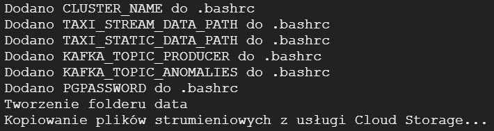

# NYC-Yellow-Taxi + Spark

# Spis treści:

1. Opis zadania
2. Producent; skrypty inicjujące i zasilający

# Zadania:

### ETL – obraz czasu rzeczywistego

Utrzymywanie agregacji na poziomie dnia i dzielnicy.
Wartości agregatów to:

- liczba wyjazdów
- liczba przyjazdów
- sumaryczna osób wyjeżdżających
- sumaryczna osób przyjeżdżających

### Wykrywanie "anomalii"

Wykrywanie "anomalii" ma polegać na wykrywaniu dużej różnicy w liczbie osób wyjeżdżających z danej dzielnicy w
stosunku do liczby przyjeżdżających do danej dzielnicy w określonym czasie.
Program ma być parametryzowany przez:

- D - długość okresu czasu wyrażoną w godzinach
- L - liczbę osób (minimalna)

Wykrywanie anomalii ma być dokonywane co godzinę. \
Przykładowo, dla parametrów D=4, L=10000 program co godzinę będzie raportował te dzielnice, w których w ciągu
ostatnich 4 godzin liczba osób "zmniejszyła się" o co najmniej 10 tysięcy osób.
Raportowane dane mają zawierać:

- analizowany okres - okno (start i stop)
- nazwę dzielnicy
- liczbę osób wyjeżdżających
- liczbę osób przyjeżdżających
- różnicę w powyższych liczbach

# Uruchomienie krok po kroku:

Opis poszczególnych skryptów znajduje się w dalszej części.

1. Skrypt ustawiający środowisko.

```shell
source setup.sh <pathToYellowTripDataResult> <pathToTaxiZoneLookup>
```

Przykładowo:

```shell
source setup.sh gs://pbd-23-AA/projekt2/yellow_tripdata_result gs://pbd-23-AA/projekt2/taxi_zone_lookup.csv
```

2. Skrypt tworzący tematy Kafki.

```shell
./manage-topics.sh up
```

3. Skrypt tworzący ujście ETL.

```shell
./manage-sink.up
```

4. Skrypt uruchamiający przetwarzanie.

```shell
./run-processing A 5 10000
```

5. Skrypt uruchamiający producenta.

```shell
./run-producer.sh
```

6. Skrypt odczytujący wyniki przetwarzania.

```shell
./run-consumer-etl.sh
./run-consumer-anomalies.sh
```

7. Skrypt czyszczący środowisko.

```shell
./clean.sh
```

Po skrypcie czyszczącym środowisko wróć do punktu 2. aby uruchomić je ponownie (np. z innymi parametrami dla skryptu
`run-processing.sh`)

# Producent i skrypty inicjujące i zasilające

- Utwórz klaster na platformie GCP przy użyciu poniższego polecenia

```shell
gcloud dataproc clusters create ${CLUSTER_NAME} \
--enable-component-gateway --bucket ${BUCKET_NAME} \
--region ${REGION} --subnet default \
--master-machine-type n1-standard-4 --master-boot-disk-size 50 \
--num-workers 2 --worker-machine-type n1-standard-2 --worker-boot-disk-size 50 \
--image-version 2.1-debian11 --optional-components FLINK,DOCKER,ZOOKEEPER \
--project ${PROJECT_ID} --max-age=3h \
--metadata "run-on-master=true" \
--initialization-actions \
gs://goog-dataproc-initialization-actions-${REGION}/kafka/kafka.sh
```

- Otwórz terminal SSH do maszyny master i wgraj na nią pliki z projektu:
    - setup.sh
    - manage-topics.sh
    - run-sink.sh (create_tables.sql)
    - run-processing.sh (main.py)
    - run-producer.sh (KafkaProducer.jar)

- Skrypt inicjalizujący środowisko. Pobiera on niezbędne biblioteki, dane wejściowe do projektu
  oraz ustawia zmienne środowiskowe (dlatego uruchamiamy poprzez polecenie source).
  Skrypt przyjmuje dwa parametry: pierwszy to folder w usłudze Cloud Storage,
  w którym znajdują się pliki główne (strumieniowe - zbiór pierwszy),
  a drugi to lokalizacja pliku statycznego (zbiór drugi) w usłudze Cloud Storage.

```shell
source setup.sh <pathToYellowTripDataResult> <pathToTaxiZoneLookup>
```

Przykładowo:

```shell
source setup.sh gs://pbd-23-AA/projekt2/yellow_tripdata_result gs://pbd-23-AA/projekt2/taxi_zone_lookup.csv
```

Wyjście po uruchomieniu skryptu powinno wyglądać mniej więcej tak:

Później logi z kopiowania plików... a zakończenie pliku tak:

Jeżeli pojawiły się błędy przy pobieraniu pakietu tree (czasami zdarza się tak jeżeli klaster nie zdążył się w pełni
zainicjalizować) to nie ma powodu do obaw, ponieważ nie jest on niezbędny. Możesz jednak go doinstalować poleceniem:

```shell
sudo apt-get install tree
```

Aby sprawdzić czy pliki zostały poprawnie pobrane na maszynę z usługi Cloud Storage możesz użyć polecenia:

```shell
tree -p data
```

Wynik powinien być dokładnie taki:

Na końcu polecenia powinieneś/powinnaś zobaczyć napis `1 directory, 101 files`. Inny wynik oznacza, że źle został
uruchomiony skrypt inicjujący (ze złymi parametrami). Aby to poprawić uruchom go jeszcze raz z poprawnymi (jest on
przystosowany do wielokrotnego uruchamiania i nie powinny wystąpić żadne błędy, a niepoprawnie zapisane pliki w
katalogu `data` zostaną nadpisane).

- Skrypt tworzący tematy Kafki (źródłowy temat oraz temat dla anomalii).

```shell
./manage-topics.sh <up|down>
```

Przykład działania:


- Skrypt czyszczący środowisko.

```shell
./clean.sh
```

# Utrzymanie obrazu czasu rzeczywistego.

Fragmentu kodu programu odpowiadającego za wyliczenia obrazu czasu rzeczywistego od poziomu źródła

```python
# -------------------------------------------------------------------------------------------------------------------- #
# STREAM
ds1 = spark.readStream
.format("kafka")
.option("kafka.bootstrap.servers", f"{host_name}:9092")
.option("subscribe", os.getenv("KAFKA_TOPIC_PRODUCER"))
.load()
valuesDF = ds1.selectExpr("CAST(value as string)")
schema = "tripID STRING, start_stop INT, timestamp STRING, locationID INT, passenger_count INT, trip_distance DOUBLE,"
" payment_type INT, amount DOUBLE, VendorID STRING"
parsedDF = valuesDF.select(from_csv(valuesDF.value, schema).alias("data")).select("data.*")
parsedDF = parsedDF.withColumn("timestamp", to_timestamp(col("timestamp"), "yyyy-MM-dd'T'HH:mm:ss.SSS'Z'"))

# -------------------------------------------------------------------------------------------------------------------- #
# STATIC
taxi_zone_lookup = spark.read.csv(os.getenv("TAXI_STATIC_DATA_PATH"), header=True, inferSchema=True)
taxi_zone_lookup = taxi_zone_lookup.withColumnRenamed("LocationID", "locationID")

# -------------------------------------------------------------------------------------------------------------------- #
# JOIN
joinedDF = parsedDF.join(taxi_zone_lookup, "locationID")

# -------------------------------------------------------------------------------------------------------------------- #
# WATERMARK
watermarkedDF = joinedDF.withWatermark("timestamp", "1 day")

# -------------------------------------------------------------------------------------------------------------------- #
# ETL

# AGREGACJE
aggregatedDF = watermarkedDF.groupBy(
    window(col("timestamp"), "1 day").alias("date"),
    "Borough"
).agg(
    coalesce(count(when(col("start_stop") == 0, True)), lit(0)).alias("num_departures"),
    coalesce(count(when(col("start_stop") == 1, True)), lit(0)).alias("num_arrivals"),
    coalesce(_sum(when(col("start_stop") == 0, col("passenger_count"))), lit(0)).alias("total_departing_passengers"),
    coalesce(_sum(when(col("start_stop") == 1, col("passenger_count"))), lit(0)).alias("total_arriving_passengers")
)
```

# Utrzymanie obrazu czasu rzeczywistego - obsługa trybu A i C

```python
# UJŚCIE ETL
output_mode = None
if mode == 'A':
    output_mode = "update"
elif mode == 'C':
    output_mode = "append"

query_etl = aggregatedDF.writeStream.outputMode(output_mode).foreachBatch(
    lambda df_batch, batch_id:
    df_batch.select(
        col("date").cast("string").alias("day"),
        col("Borough").alias("borough"),
        col("num_departures"),
        col("num_arrivals"),
        col("total_departing_passengers"),
        col("total_arriving_passengers")
    ).write
    .format("jdbc")
    .mode("append")
    .option("url", f"jdbc:postgresql://{host_name}:54320/streamoutput")
    .option("dbtable", "taxi_etl")
    .option("user", "postgres")
    .option("password", os.getenv("PGPASSWORD"))
    .save()
).option("checkpointLocation", "/tmp/etl").start()
```

# Wykrywanie anomalii

```python
# AGREGACJE
anomalyDF = watermarkedDF.groupBy(
    window(col("timestamp"), f"{D} hours", "1 hour").alias("anomaly_window"),
    "Borough"
).agg(
    coalesce(_sum(when(col("start_stop") == 0, col("passenger_count"))), lit(0)).alias("total_departing_passengers"),
    coalesce(_sum(when(col("start_stop") == 1, col("passenger_count"))), lit(0)).alias("total_arriving_passengers")
).withColumn(
    "difference", col("total_departing_passengers") - col("total_arriving_passengers")
).filter(
    col("difference") >= L
)

query_anomaly = anomalyDF.selectExpr(
    "anomaly_window",
    "Borough AS borough",
    "total_departing_passengers",
    "total_arriving_passengers",
    "difference"
).selectExpr(
    "to_json(struct(*)) AS value"
).writeStream
.format("kafka")
.option("kafka.bootstrap.servers", f"{host_name}:9092")
.option("topic", os.getenv("KAFKA_TOPIC_ANOMALIES"))
.option("checkpointLocation", "/tmp/anomalies")
.start()
```

# Program przetwarzający strumienie danych, skrypt uruchamiający

- Skrypt przetwarzający dane w wersji A

```shell
./run-processing.sh A 4 10000
```

- Uruchom skrypt przetwarzający dane w wersji C

```shell
./run-processing.sh C 10 5
```

# Miejsce utrzymywania obrazów czasu rzeczywistego – skrypt tworzący

```shell
./manage-sink.sh up
```

Przykład poprawnego działania:


Możesz sprawdzić czy ujście dla ETL działa prawidłowo poleceniem:

```shell
docker ps
```

Przykład poprawnego działania:


# Miejsce utrzymywania obrazów czasu rzeczywistego – cechy

# Konsument: skrypt odczytujący wyniki przetwarzania

Obraz czasu rzeczywistego:

```shell
./run-consumer-etl.sh
```

Przykład działania:


Wykrywanie anomalii:

```shell
./run-consumer-anomalies.sh
```